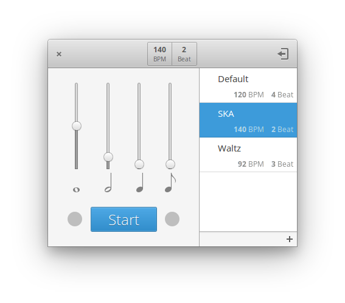

# Metronome

### A simple metronome designed for [elementary OS](https://elementary.io)

You'll need the following dependencies:
* cmake
* cmake-elementary
* debhelper
* libgstreamer1.0-dev
* libgranite-dev
* valac
